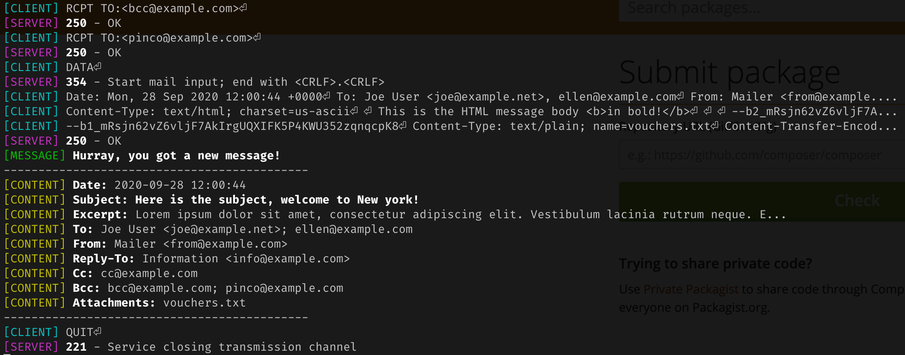
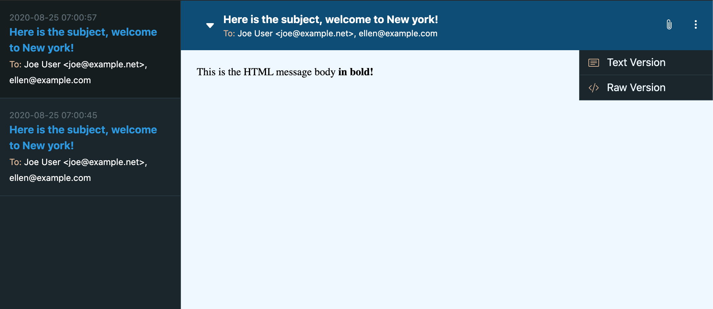

# Mailamie
**Catch All SMTP Server for testing**

## Index

- [About](#about)
- [Install](#install)
- [Options](#options)
- [Settings](#settings)
- [Testing](#options)
- [Changelog](changelog.md)
- [License](license.md)

## About

**Mailamie** is a pretty simple Catch All SMTP Server for testing completely written in PHP and based on the great work
made by the folks at [ReactPhp](https://reactphp.org/).

It's in no way a replacement for more complete tools such as [Mailhog](https://github.com/mailhog/MailHog) as it doesn't 
actually check SMTP implementantion details, instead it only cares about getting emails headers and body for high level
delivery testing.

**Mailamie** can be used directly from the CLI:



also in verbose mode:


or, for better UX, in the browser:



## Install

**Mailamie** requires PHP ^7.4. To install it globally on your system run the following command to install:

```shell script
composer global require micc83/mailamie
```

## Options

Run the following command to get help:

```shell script
mailamie --help
```

The outout will be:

```shell script
Description:
  Mailamie is catch all SMTP server for testing.

Usage:
  mailamie [options]
  mailamie --host=127.0.0.1:25    Ex. SMTP Host definition

Options:
  -H, --host=HOST       Set the host on which to listen for SMTP calls
  -h, --help            Display this help message
  -q, --quiet           Do not output any message
  -V, --version         Display this application version
      --ansi            Force ANSI output
      --no-ansi         Disable ANSI output
  -n, --no-interaction  Do not ask any interactive question
  -v|vv|vvv, --verbose  Increase the verbosity of messages: 1 for normal output, 2 for more verbose output and 3 for debug

Help:
  You can define custom configuration from the file ~/.mailamie.config.php,
  check the project readme file at https://github.com/micc83/mailamie
```

## Settings

You can define default settings in `~/.mailamie.config.php`, in order to do so run:

```shell script
touch ~/.mailamie.config.php  && vim ~/.mailamie.config.php
```

This files returns a PHP array with the following available settings. 

```php
<?php
/**
 * Mailamie settings.
 */
return [
    'smtp' => [
        'host' => '127.0.0.1:8025',
    ],

    'web' => [
        'host' => '127.0.0.1:8080',
    ],

    'websocket' => [
        'host' => '127.0.0.1:1338',
    ],
];
```

You'd better define only the needed one, in case something should change after upgrades.

## Testing
Run phpunit with coverage
```shell script
phpdbg -qrr ./vendor/bin/phpunit --coverage-text
```