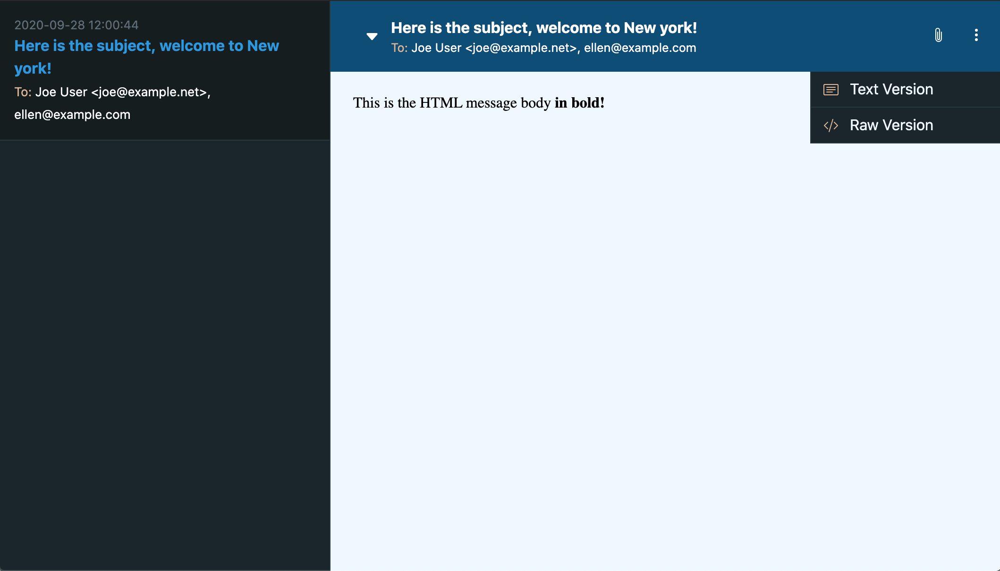

# Mailamie
**Catch All SMTP Server for testing**

 


## Index

- [Why](#why)
- [About](#how)
- [Install](#install)
- [Usage](#usage)
- [Settings](#settings)
- [Changelog](changelog.md)
- [License](license.md)

## Why

Sometime you just need a simple tool to verify that some legacy project, without tests in place or with some 
very complex environment, sends the right emails to the right people. Surely there're many valid tools out there for the 
job but as it's not something happening every day it's pretty cumbersome having to install these tools.

**Mailamie** is a side project I've put up in my summer vacations for playing with async PHP. Using it is as simple 
as setting a few parameters on your project:
```dotenv
# Ex. Laravel .env file
MAIL_MAILER=smtp
MAIL_HOST=smtp.mailtrap.io
MAIL_PORT=8025
MAIL_ENCRYPTION=null
```
and running it with the command:
```shell script
$ mailamie
```

## How

**Mailamie** is a pretty simple Catch All SMTP Server for local testing completely written in PHP and based on the great 
work made by the folks at [ReactPhp](https://reactphp.org/). 

It's in no way a replacement for more complete tools such as [Mailhog](https://github.com/mailhog/MailHog) as it doesn't 
actually check SMTP implementantion details, instead it only cares about getting emails headers and body for high level
delivery testing.

**DO NOT USE IN PRODUCTION**. Mailamie starts three different servers (SMTP on port 8025, HTTP on port 8080, WebSocket 
on port 1338). No steps have been taken to secure any of the three. Also, external access to those ports should be 
blocked.

**Mailamie** can be used directly from the CLI:


or, for better UX, in the browser:



## Install

**Mailamie** requires PHP ^7.4. To install it globally on your system run the following command to install:

```shell script
composer global require micc83/mailamie
```

## Usage

Run the following command to get help:

```shell script
mailamie --help
```

The output will be:

```shell script
Description:
  Mailamie is catch all SMTP server for testing.

Usage:
  mailamie [options]
  mailamie --host=127.0.0.1 --port=25    Ex. SMTP Host definition

Options:
  -H, --host=HOST       Set the host on which to listen for calls
  -p, --port=PORT       Set the port on which to listen for SMTP calls
  -h, --help            Display this help message
  -q, --quiet           Do not output any message
  -V, --version         Display this application version
      --ansi            Force ANSI output
      --no-ansi         Disable ANSI output
  -n, --no-interaction  Do not ask any interactive question
  -v|vv|vvv, --verbose  Increase the verbosity of messages: 1 for normal output, 2 for more verbose output and 3 for debug

Help:
  You can define custom configuration from the file ~/.mailamie.config.php,
  check the project readme file at https://github.com/micc83/mailamie
  for all the available settings.
```

## Settings

You can define default settings in `~/.mailamie.config.php`, in order to do so run:

```shell script
$ touch ~/.mailamie.config.php && vim ~/.mailamie.config.php
```

This files returns a PHP array with the following available settings. 

```php
<?php

return [
    'smtp' => [
        'host' => '127.0.0.1',
        'port' => '8025'
    ],

    'http' => [
        'host' => '127.0.0.1',
        'port' => '8080'
    ],

    'websocket' => [
        'host' => '127.0.0.1',
        'port' => '1338'
    ],
];
```

You'd better define only the needed ones, in case something should change after upgrades.